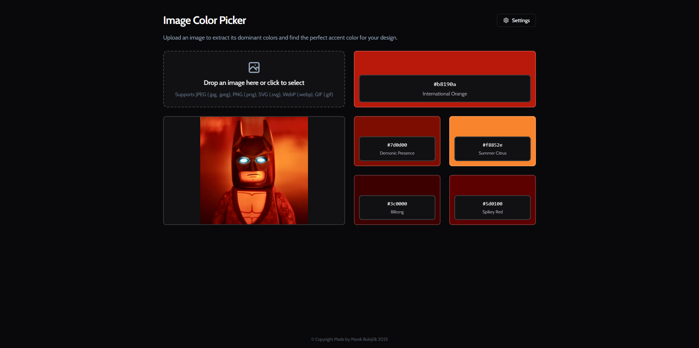

# Portfolio

A multilingual portfolio showcasing front-end projects and skills.

## Tech Stack
- HTML
- CSS
- JavaScript

## Deployment
The site is deployed at [https://marekbulejcik.github.io/portfolio/](https://marekbulejcik.github.io/portfolio/).

## Screenshot


## Running Locally
1. Clone the repository.
2. Open `index.html` directly in your browser **or** serve the folder locally:
   ```bash
   python3 -m http.server 3000
   ```
3. Visit `http://localhost:3000` in your browser.
